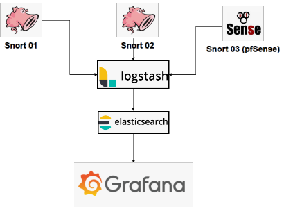
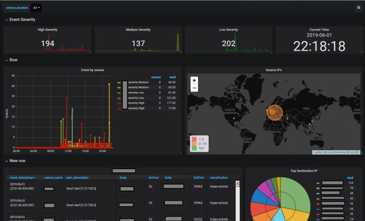
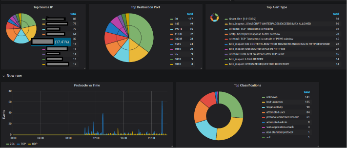
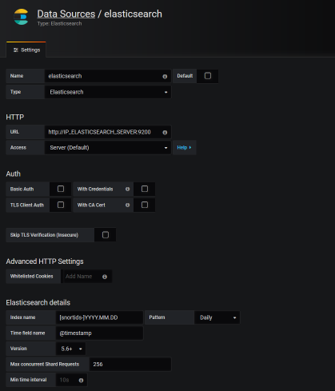

# Snort2 grafana dashboard

While production IDS/IPS still wait for Snort3 where JSON logging is available (or Suricata) it may be useful give elasticity of logs handling given by Elasticsearch and Grafana for Snort2

Project is based on existing grafana security dashboard
but removes existing hard-coded dependencies and provides all configuration details for Snort, Barnyard2, Elasticsearch and Grafana.

Logs flow and components:

Example dashboards:

<b>Snort configuration:</b>
Snort uses "-l" configuration inside systemd service definition to inform what is the log output directory.

<b>Barnyard2 configuration:</b>

Barnyard2 takes files from snort and sends them via UDP protocol to Logstash server listening to 5142 udp port

<b>Logstash:</b>

Logstash listen to 5142 and all logs marks with "snort" tag.
Tagged "snort" logs are treated with grok and later some transformation.
Output for snort log is set to elasticsearch and index name like snortids-%YY-%MM-%dd

<b>Grafana:</b>

Just connects to defined Elasticsearch clusters:

EL datasource definition (before importing Grafana dashboard):

